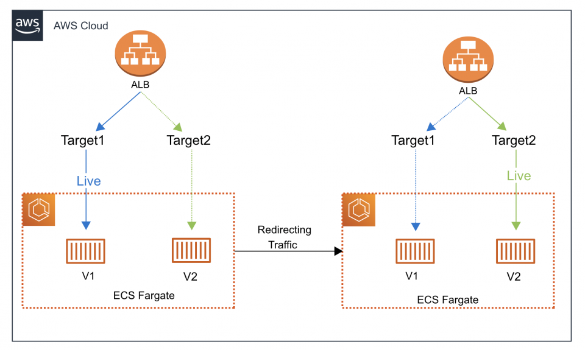

# AWS Solution Architectures

## [Fargate Blue Green Deployment](./fargate-blue-green-deployment/README.md)

## [RDS Proxy (PostgreSQL) & ALB + EC2](./rds-proxy-alb-ec2/README.md)

## [RDS Proxy (PostgreSQL) & API Gateway + Lambda](./rds-proxy-apigw-lambda/README.md)

## [Site to Site VPN with OnPremise IP Overlapping](./site-to-site-vpn-with-ip-overlapping/README.md)
