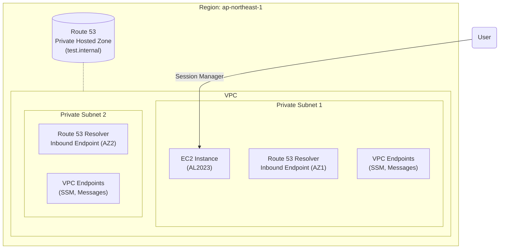

# Cross Region PrivateLink Demo

This project sets up an AWS environment to demonstrate Route 53 Resolver Endpoints and Private Hosted Zones within a VPC, managed by Terraform. It includes an EC2 instance accessible via AWS Systems Manager Session Manager.

## Architecture

The following diagram illustrates the resources created by this Terraform configuration:



## Resources Created

-   **VPC**: A VPC with DNS hostnames and support enabled.
-   **Subnets**: Two private subnets in different Availability Zones.
-   **EC2 Instance**: An Amazon Linux 2023 instance for testing.
-   **Route 53 Resolver Inbound Endpoint**: Allows DNS queries from on-premises or other VPCs to resolve records in this VPC's Private Hosted Zone.
-   **Route 53 Private Hosted Zone**: A zone named `test.internal` with a sample A record.
-   **VPC Endpoints**: Interface endpoints for SSM, SSMMessages, and EC2Messages to enable secure connection to the EC2 instance without internet access.
-   **Security Groups**:
    -   `ec2-sg`: Allows outbound traffic.
    -   `vpce-sg`: Allows HTTPS ingress from the VPC.
    -   `resolver-sg`: Allows DNS (TCP/UDP 53) ingress from the VPC.
-   **IAM Role**: An IAM role with `AmazonSSMManagedInstanceCore` policy attached to the EC2 instance.

## Prerequisites

-   [Terraform](https://www.terraform.io/downloads.html) (v1.9.0+)
-   [AWS CLI](https://aws.amazon.com/cli/) installed and configured with appropriate credentials.

## Usage

1.  **Initialize Terraform**:
    ```bash
    terraform init
    ```

2.  **Plan the deployment**:
    ```bash
    terraform plan
    ```

3.  **Apply the configuration**:
    ```bash
    terraform apply
    ```

4.  **Connect to the EC2 Instance**:
    Use the AWS Console or AWS CLI to connect via Session Manager.
    ```bash
    aws ssm start-session --target <Instance-ID>
    ```

5.  **Test DNS Resolution**:
    Once connected to the EC2 instance, verify that the private domain resolves to the dummy IP.
    ```bash
    # Install bind-utils if dig is not available
    sudo dnf install -y bind-utils

    # Perform DNS lookup
    dig app.test.internal +short
    # Expected Output: 10.0.0.100
    ```

## Outputs

-   `vpc_id`: The ID of the created VPC.
-   `instance_id`: The ID of the test EC2 instance.
-   `resolver_endpoint_ips`: The IP addresses of the Route 53 Resolver Inbound Endpoint.
-   `hosted_zone_id`: The ID of the Private Hosted Zone.
