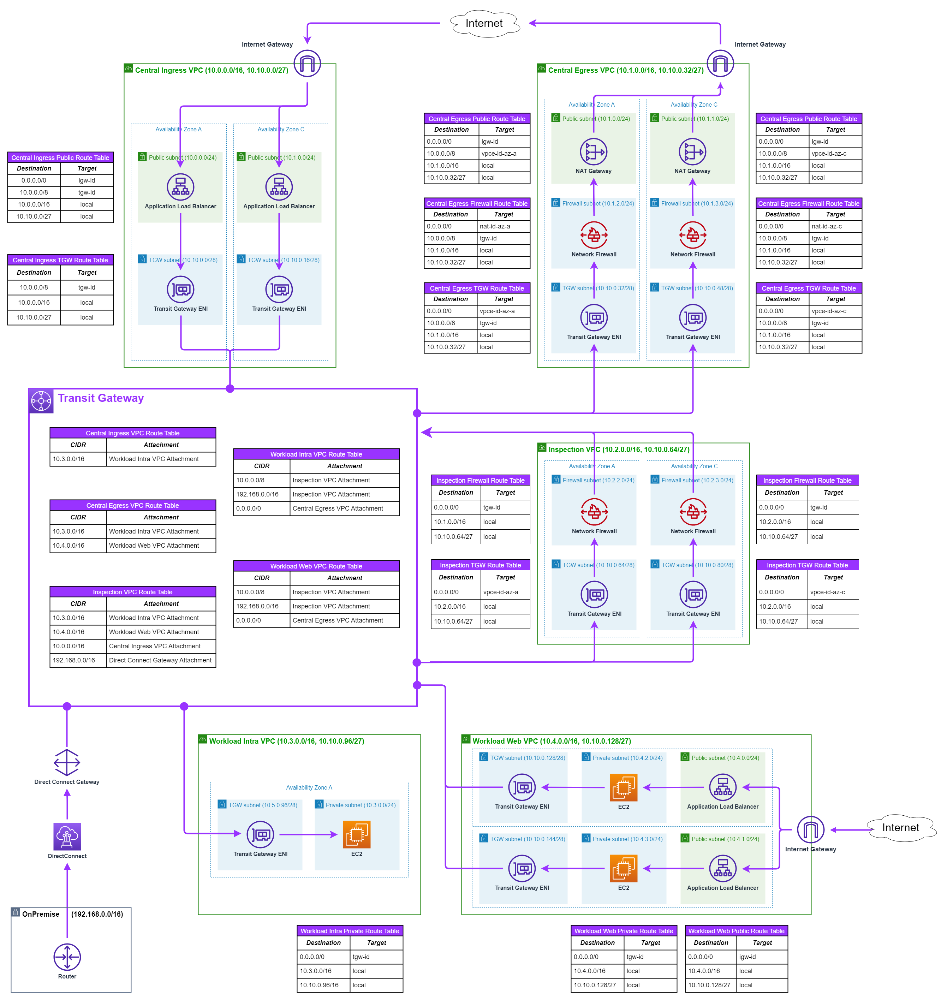

# AWS Enterprise Architecture - Networking
Some customers may wish to have centralized internet egress protected by AWS Network Firewall and a separate instance of the AWS Network Firewall for East-West traffic. In this case, there is a cost saving with this architecture in terms of data processing cost reduction as traffic goes directly from a source VPC to centralized egress VPC without using inspection VPC.

## Inspection VPC only for East-West traffic and egress VPC with inspection for internet
