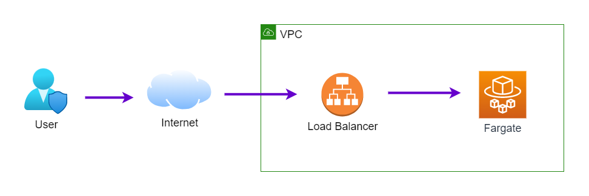

# AWS Fargate Blue Green Deployment

## What's the Goals

- Create ECS cluster and deploy application as blue environment
- Deploy new version of application as green environment
- Test green version via test port
- Reroute traffic to green environment for release application

## What's the Architecture



## What's the Methodology


## How to do

### Create Blue Environment

```
$ terraform init
$ terraform apply -auto-approve

app_url = "http://bluegreen-alb-99999999.ap-northeast-1.elb.amazonaws.com/"
appspec_s3_location = "bucket=bluegreen-configs,bundleType=yaml,eTag=525211c1fddb460e77a69541760fb74c,key=appspec.yaml"
codedeploy_application = "bluegreen-app"
codedeploy_deployment_group_name = "bluegreen"
ecs_cluster_name = "bluegreen-cluster"
ecs_service_name = "bluegreen-service"
ecs_task_definition_name = "bluegreen-task"

# test
curl http://bluegreen-alb-99999999.ap-northeast-1.elb.amazonaws.com/
blue
```

### Create Green Environment

```
# update task definition to green version
$ terraform apply -var environment="green" -auto-approve

# execute deployment
$ aws deploy create-deployment \
    --application-name bluegreen-app \
    --deployment-config-name CodeDeployDefault.ECSAllAtOnce \
    --deployment-group-name bluegreen \
    --s3-location bucket=bluegreen-configs,bundleType=yaml,key=appspec.yaml

{
    "deploymentId": "d-5CGUL6ETM"
}

# confirm deployment success (replace deployment id before execute)
$ aws deploy get-deployment --deployment-id d-0W4JBD7JA | jq .deploymentInfo.status

```

### Test Green Environment via Test Port

```
$ curl http://bluegreen-alb-1913291611.ap-northeast-1.elb.amazonaws.com:8080/
green
```

### Switch Blue Environment to Green Environment

```
$ aws deploy continue-deployment \
    --deployment-id "d-0W4JBD7JA" \
    --deployment-wait-type "READY_WAIT"
```

### Test Green Environment via Production Port

```
$ curl http://bluegreen-alb-99999999.ap-northeast-1.elb.amazonaws.com/
green
```

### Terminate Original Instances

```
aws deploy continue-deployment \
    --deployment-id "d-0W4JBD7JA" \
    --deployment-wait-type "TERMINATION_WAIT"
```

### Destroy Environment

```
$ terraform apply -destroy -auto-approve
```
