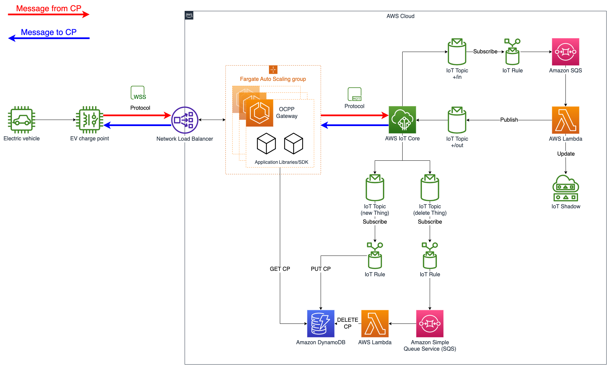

# Building an OCPP-Compliant electric vehicle charge point operator solution using AWS IoT Core

## [Overview](https://aws.amazon.com/jp/blogs/news/building-an-ocpp-compliant-electric-vehicle-charge-point-operator-solution-using-aws-iot-core/)
市販されているほとんどの CP は、CPO との双方向パブリッシュ アンド サブスクライブ通信の手段として OCPP を実装しています。 AWS で CPO を運用するには、CP が通信する OCPP WebSocket エンドポイントを導入する必要があります。 このエンドポイントは OCPP Gateway と呼ばれ OCPP と MQTT の間のプロキシとして機能し AWS IoT Core や AWS 上に構築された下流 CPO サービスとの統合を可能にします。

## Architecture
|  |
|:--:| 
| *Figure 1: OCPP Gateway solution stack architecture* |

## Prerequisites
1. An [AWS account](https://aws.amazon.com/premiumsupport/knowledge-center/create-and-activate-aws-account/)
2. `AdministratorAccess` policy granted to your AWS account (for production, we recommend restricting access as needed)
3. Both console and programmatic access
4. [AWS CLI](https://aws.amazon.com/cli/) installed and configured to use with your AWS account
5. [Terraform](https://developer.hashicorp.com/terraform/install?product_intent=terraform) installed
6. [Docker](https://docs.docker.com/get-docker/) installed
7. [Python 3+](https://www.python.org/downloads/) installed
8. [NodeJS 12+](https://nodejs.org/en/download/) installed

## Deployment
1. Deploy the OCPP Gateway using the following CDK command:

```bash
npm run start
```

2. Your output will look like:
```bash
Outputs:

ws_endpoint = "ws://OcppGw-Gateway-f8054b9125062ea8.elb.ap-northeast-1.amazonaws.com"
```

## Simulating CP connectivity
The `simulate.py` Python script to help you test and explore the capability of the OCPP Gateway and AWS IoT Core without the need for a physical CP. Other OCPP simulators, like [OCPP-2.0-CP-Simulator](https://github.com/JavaIsJavaScript/OCPP-2.0-CP-Simulator), can also be used.

### Simulation setup
1. Create a simple thing using AWS CLI

```bash
aws iot create-thing --thing-name CP1

{
  "thingName": "CP1",
  "thingArn": "arn:aws:iot:ap-northeast-1:999999999999:thing/CP1",
  "thingId": "9d072843-8b82-45c0-8515-08bc6a53939e"
}
```

2. Navigate to this folder with your terminal:
```bash
cd ev-charge-point-simulator
```

3. Create a Python virtual environment and activate it by running this command:
```bash
python3 -m venv venv && source venv/bin/activate
```

4. Install the Python dependencies by running:
```bash
pip3 install -r requirements.txt
```

### Simulate an EV charge point boot and heartbeat notification
The Python script simulates some basic functionality of an EV charge point:

- Sending a [`BootNotification`](https://raw.githubusercontent.com/mobilityhouse/ocpp/master/docs/v201/OCPP-2.0.1_part2_specification.pdf#bootnotification), including attributes about the CP hardware
- Sending [`Heartbeat`](https://raw.githubusercontent.com/mobilityhouse/ocpp/master/docs/v201/OCPP-2.0.1_part2_specification.pdf#heartbeat) messages based on a frequency instructed by the CPO (this is defined by the `interval` parameter returned in the response to the `BootNotification`)


1. Run the Python script using the following command, making sure to replace the `--url` value with the `AwsOcppGatewayStack.websocketURL` returned from the cdk deployment:
```bash
python3 simulate.py --url {websocket URL generated from Terraform} --cp-id CP1
```

> **Note**: we are using `--cp-id CP1` which *must* match the value of the IoT Thing created above. If the `--cp-id` doesn't match the IoT Thing name, the connection will be rejected by the OCPP Gateway.

A successful output should look like this:

```bash
(venv) ev-charge-point-simulator % python3 simulate.py --url {websocket URL generated from Terraform} --cp-id CP1 
INFO:ocpp:CP1: send [2,"0678cb2a-a7a2-42bc-8037-d01164e77ac6","BootNotification",{"chargingStation":{"model":"ABC 123 XYZ","vendorName":"Acme Electrical Systems","firmwareVersion":"10.9.8.ABC","serialNumber":"CP1234567890A01","modem":{"iccid":"891004234814455936F","imsi":"310410123456789"}},"reason":"PowerUp"}]
INFO:ocpp:CP1: receive message [3,"0678cb2a-a7a2-42bc-8037-d01164e77ac6",{"currentTime":"2023-02-16T19:00:18.630818","interval":10,"status":"Accepted"}]
INFO:root:CP1: connected to central system
INFO:root:CP1: heartbeat interval set to 10
INFO:ocpp:CP1: send [2,"9b7933a7-5216-496d-9bb0-dae45014bb98","Heartbeat",{}]
INFO:ocpp:CP1: receive message [3,"9b7933a7-5216-496d-9bb0-dae45014bb98",{"currentTime":"2023-02-16T19:00:19.073675"}]
```

This exchange represents a successful simulation of a CP, first sending a `BootNotification`, followed by subsequent `Heartbeat` at the specified interval. The output includes both the simulated OCPP message sent from the CP to AWS IoT (prefixed `send`) and the response received from AWS (prefixed `received message`).
