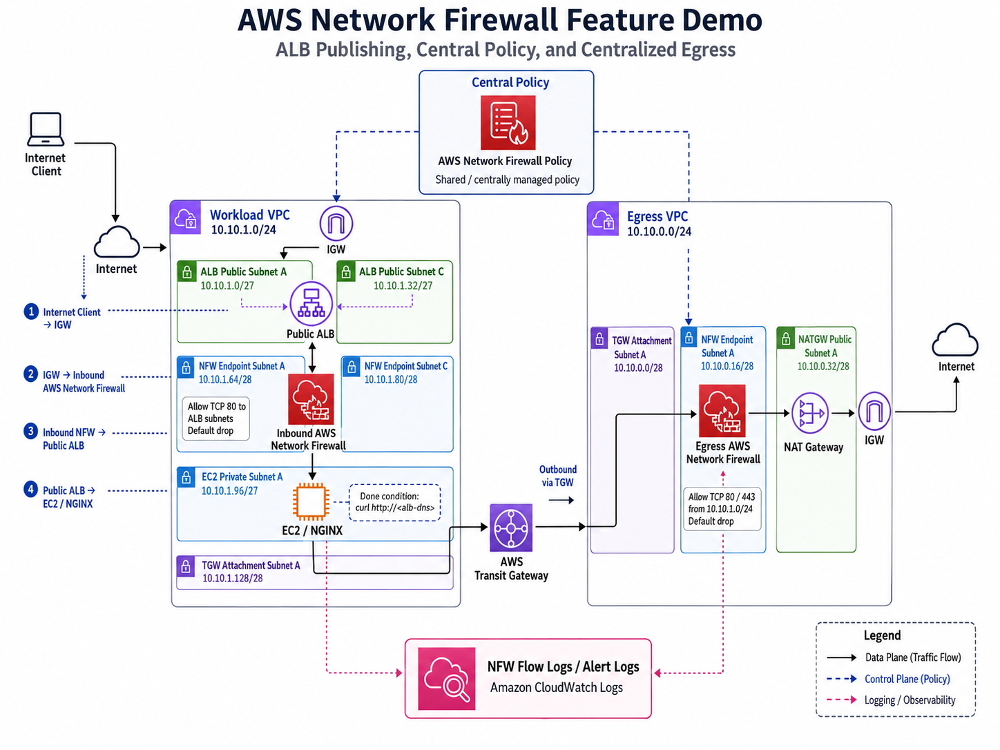

# AWS Network Firewall Demo Terraform

このディレクトリは、AWS Network Firewall を使った最小デモ環境を Terraform で構築します。

作成する構成は次の 2 VPC です。

- Workload VPC: Internet から ALB を公開し、private subnet の EC2 上で NGINX を動かします。
- Egress VPC: Workload VPC からの outbound を Transit Gateway 経由で受け、AWS Network Firewall と NAT Gateway を通して Internet へ出します。

## 構成概要



Inbound:

Internet -> IGW ingress route table -> Workload NFW endpoint -> Public ALB -> Private EC2 -> NGINX

Outbound:

Private EC2 -> Transit Gateway -> Egress TGW attachment -> Egress NFW endpoint -> NAT Gateway -> IGW -> Internet

実装のポイント:

- EC2 は private subnet に配置し、public IP は付与しません。
- Workload VPC の inbound NFW は ALB subnet CIDR への TCP/80 のみ許可し、default drop にします。
- Egress VPC の outbound NFW は Workload VPC CIDR からの TCP/80 と TCP/443 のみ許可し、default drop にします。
- NFW endpoint ID は firewall_status.sync_states から取得して route table に設定します。
- NAT Gateway 作成後に 90 秒、egress 経路完成後に 120 秒の待機を入れ、EC2 user_data の失敗を避けます。

## 前提条件

- Terraform 1.6 以上
- AWS 認証情報が有効であること
- 対象リージョンで AWS Network Firewall, Transit Gateway, NAT Gateway, ALB, EC2 が利用可能であること

デフォルトリージョンは `ap-northeast-1` です。変更する場合は `-var aws_region=<region>` を指定してください。

## apply 手順

```bash
terraform init
terraform fmt -recursive
terraform validate
terraform apply
```

apply 完了後に出力を確認します。

```bash
terraform output
terraform output -raw nginx_url
```

## 完了確認手順

Done 条件は、Terraform apply 成功ではなく、ALB 経由の HTTP 応答確認です。

```bash
curl $(terraform output -raw nginx_url)
```

期待結果:

```html
<h1>AWS NFW Demo - NGINX OK</h1>
```

標準の NGINX welcome page が返っても完了扱いにできますが、この実装では上記のカスタム HTML を配置します。

## destroy 手順

```bash
terraform destroy
```

Network Firewall, NAT Gateway, ALB, Transit Gateway の削除には時間がかかることがあります。
