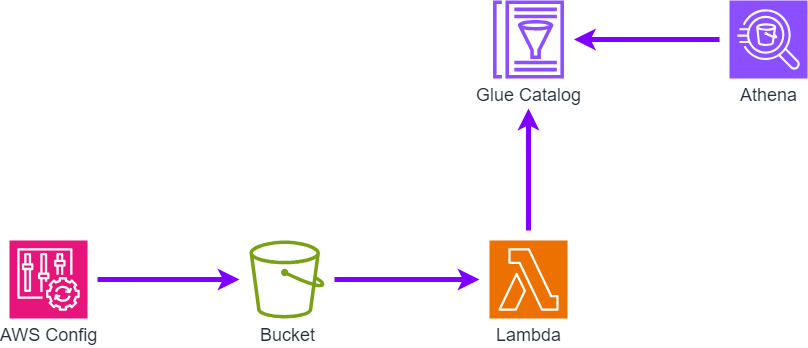

# Querying AWS Config data using Amazon Athena
[How to query your AWS resource configuration states using AWS Config and Amazon Athena](https://aws.amazon.com/blogs/mt/how-to-query-your-aws-resource-configuration-states-using-aws-config-and-amazon-athena/)のブログを参考し、構築しています。

## Points
- 24時間毎に S3 Bucket に最新の設定情報が配布される
- Lambda 経由で、Glue table に対して、`latest` の partition key を更新する

## Architecture
