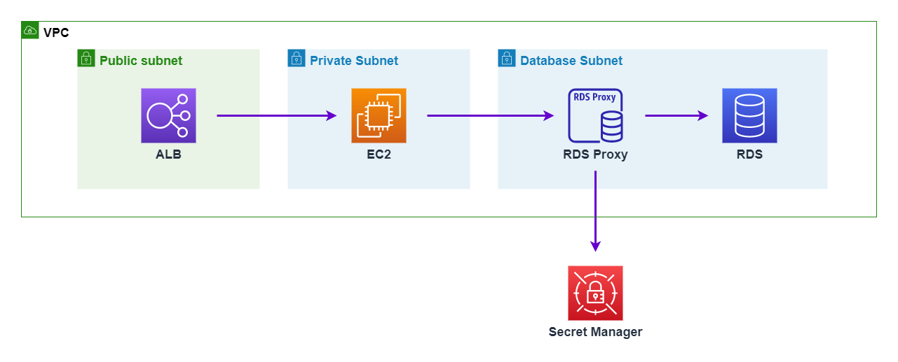

# Application Load Balancer + EC2 + RDS Proxy + PostgreSQL

## What's the Goals

## What's the Architecture



## How to do

```bash
$ terraform apply -auto-approve

$ export ALB_DNS_NAME=$(terraform output alb_dns_name)
$ curl "$ALB_DNS_NAME/v1/query"
```
